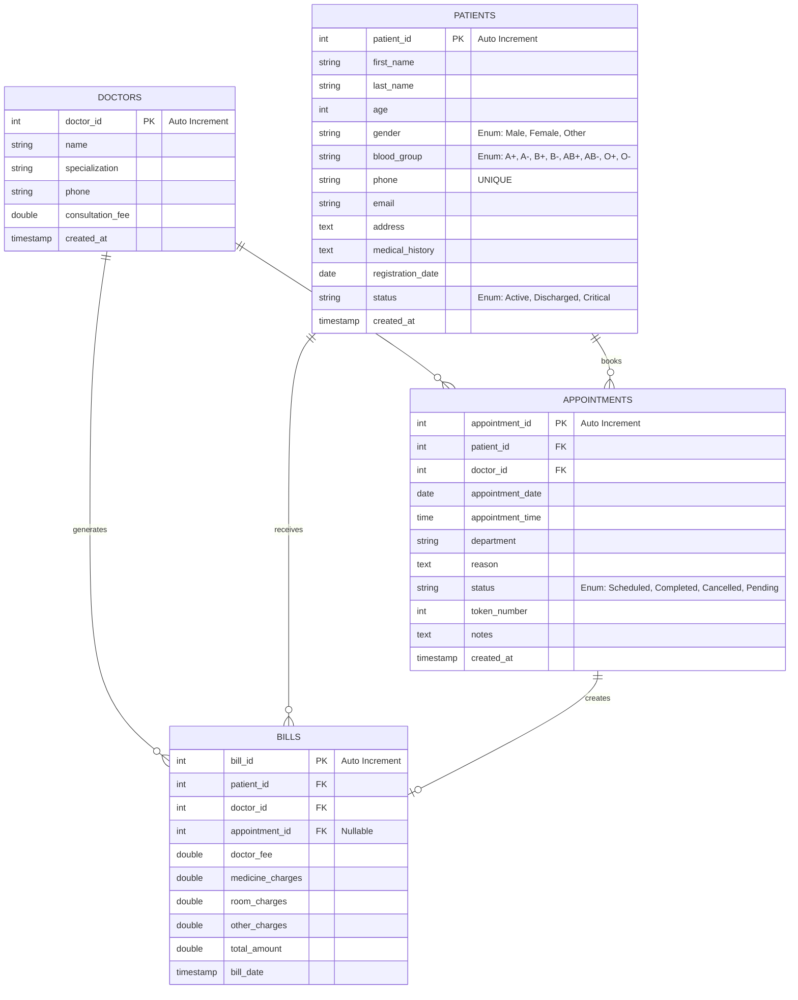

# Hospital Management System - Entity Relationship Diagram

## Overview
This document presents the Entity Relationship Diagram (ERD) for the Hospital Management System, illustrating the database schema and relationships between entities.

---

## ER Diagram (Mermaid)



---

## Entity Descriptions

### 1. **DOCTORS**
Stores information about doctors in the hospital.

| Field | Type | Constraints | Description |
|-------|------|-------------|-------------|
| `doctor_id` | INT | PK, AUTO_INCREMENT | Unique identifier for doctor |
| `name` | VARCHAR(100) | NOT NULL | Doctor's full name |
| `specialization` | VARCHAR(100) | NOT NULL | Medical specialization (e.g., Cardiology, Neurology) |
| `phone` | VARCHAR(15) | - | Contact phone number |
| `consultation_fee` | DOUBLE | NOT NULL, DEFAULT 0 | Fee charged per consultation |
| `created_at` | TIMESTAMP | DEFAULT CURRENT_TIMESTAMP | Record creation timestamp |

**Relationships:**
- One doctor can have many appointments
- One doctor can have many bills

---

### 2. **PATIENTS**
Stores patient demographic and medical information.

| Field | Type | Constraints | Description |
|-------|------|-------------|-------------|
| `patient_id` | INT | PK, AUTO_INCREMENT | Unique identifier for patient |
| `first_name` | VARCHAR(50) | NOT NULL | Patient's first name |
| `last_name` | VARCHAR(50) | NOT NULL | Patient's last name |
| `age` | INT | NOT NULL, CHECK(0 < age < 150) | Patient's age |
| `gender` | ENUM | NOT NULL | Gender: Male, Female, Other |
| `blood_group` | ENUM | NOT NULL | Blood group: A+, A-, B+, B-, AB+, AB-, O+, O- |
| `phone` | VARCHAR(15) | NOT NULL, UNIQUE | Contact phone number (unique) |
| `email` | VARCHAR(100) | - | Email address |
| `address` | TEXT | - | Residential address |
| `medical_history` | TEXT | - | Previous medical conditions/history |
| `registration_date` | DATE | DEFAULT CURDATE() | Date of patient registration |
| `status` | ENUM | DEFAULT 'Active' | Status: Active, Discharged, Critical |
| `created_at` | TIMESTAMP | DEFAULT CURRENT_TIMESTAMP | Record creation timestamp |

**Relationships:**
- One patient can have many appointments
- One patient can have many bills

---

### 3. **APPOINTMENTS**
Manages appointment scheduling between patients and doctors.

| Field | Type | Constraints | Description |
|-------|------|-------------|-------------|
| `appointment_id` | INT | PK, AUTO_INCREMENT | Unique identifier for appointment |
| `patient_id` | INT | FK, NOT NULL, ON DELETE CASCADE | Reference to PATIENTS table |
| `doctor_id` | INT | FK, NOT NULL, ON DELETE CASCADE | Reference to DOCTORS table |
| `appointment_date` | DATE | NOT NULL | Date of appointment |
| `appointment_time` | TIME | NOT NULL | Time of appointment |
| `department` | VARCHAR(100) | NOT NULL | Medical department (e.g., Cardiology) |
| `reason` | TEXT | - | Reason for visit/appointment |
| `status` | ENUM | DEFAULT 'Scheduled' | Status: Scheduled, Completed, Cancelled, Pending |
| `token_number` | INT | - | Queue token number |
| `notes` | TEXT | - | Additional notes from doctor |
| `created_at` | TIMESTAMP | DEFAULT CURRENT_TIMESTAMP | Record creation timestamp |

**Relationships:**
- Many appointments belong to one patient (FK: patient_id)
- Many appointments belong to one doctor (FK: doctor_id)
- One appointment can be referenced in bills

---

### 4. **BILLS**
Tracks billing information for patients.

| Field | Type | Constraints | Description |
|-------|------|-------------|-------------|
| `bill_id` | INT | PK, AUTO_INCREMENT | Unique identifier for bill |
| `patient_id` | INT | FK, NOT NULL, ON DELETE CASCADE | Reference to PATIENTS table |
| `doctor_id` | INT | FK, NOT NULL, ON DELETE CASCADE | Reference to DOCTORS table |
| `appointment_id` | INT | FK, Nullable, ON DELETE SET NULL | Reference to APPOINTMENTS table |
| `doctor_fee` | DOUBLE | NOT NULL, DEFAULT 0 | Doctor's consultation fee |
| `medicine_charges` | DOUBLE | NOT NULL, DEFAULT 0 | Medicine/prescription charges |
| `room_charges` | DOUBLE | NOT NULL, DEFAULT 0 | Hospital room charges |
| `other_charges` | DOUBLE | NOT NULL, DEFAULT 0 | Other miscellaneous charges |
| `total_amount` | DOUBLE | NOT NULL, DEFAULT 0 | Total bill amount |
| `bill_date` | TIMESTAMP | DEFAULT CURRENT_TIMESTAMP | Date of bill generation |

**Indexes:**
- `idx_patient_id` on `patient_id`
- `idx_doctor_id` on `doctor_id`
- `idx_bill_date` on `bill_date`

**Relationships:**
- Many bills belong to one patient (FK: patient_id)
- Many bills belong to one doctor (FK: doctor_id)
- Many bills can reference one appointment (FK: appointment_id)

---

## Relationship Summary

| From | To | Type | Cardinality | Description |
|------|-----|------|-------------|-------------|
| DOCTORS | APPOINTMENTS | 1 to Many | 1:N | A doctor can have multiple appointments |
| DOCTORS | BILLS | 1 to Many | 1:N | A doctor can be referenced in multiple bills |
| PATIENTS | APPOINTMENTS | 1 to Many | 1:N | A patient can book multiple appointments |
| PATIENTS | BILLS | 1 to Many | 1:N | A patient can receive multiple bills |
| APPOINTMENTS | BILLS | 1 to Many | 1:N | An appointment can be referenced in bills |

---

## Key Constraints

### Primary Keys
- `doctors.doctor_id`
- `patients.patient_id`
- `appointments.appointment_id`
- `bills.bill_id`

### Foreign Keys with Cascade Delete
- `appointments.patient_id` → `patients.patient_id` (ON DELETE CASCADE)
- `appointments.doctor_id` → `doctors.doctor_id` (ON DELETE CASCADE)
- `bills.patient_id` → `patients.patient_id` (ON DELETE CASCADE)
- `bills.doctor_id` → `doctors.doctor_id` (ON DELETE CASCADE)
- `bills.appointment_id` → `appointments.appointment_id` (ON DELETE SET NULL)

### Unique Constraints
- `patients.phone` - Each patient must have a unique phone number

### Check Constraints
- `patients.age` - Age must be between 0 and 150

---

## Data Flow

```
┌─────────────────────────────────────────────────────────────┐
│                   HOSPITAL MANAGEMENT FLOW                   │
├─────────────────────────────────────────────────────────────┤
│                                                               │
│  PATIENTS ────→ APPOINTMENTS ←──── DOCTORS                  │
│      ↓                                   ↓                    │
│      └─────────────→ BILLS ←─────────────┘                   │
│                                                               │
│  1. Patient registers → PATIENTS table                       │
│  2. Patient books appointment → APPOINTMENTS table           │
│  3. Doctor consults with patient                             │
│  4. Bill generated → BILLS table                             │
│                                                               │
└─────────────────────────────────────────────────────────────┘
```

---

## Database Design Notes

1. **Normalization**: Database is normalized to 3NF (Third Normal Form)
2. **Referential Integrity**: All foreign key relationships use CASCADE DELETE to maintain data consistency
3. **Temporal Data**: Uses TIMESTAMP for audit trails (`created_at`, `bill_date`)
4. **Enums**: Used for fixed-value fields (gender, blood_group, status, appointment_status)
5. **Indexes**: Strategic indexes on foreign keys and frequently queried fields for performance
6. **Data Validation**: CHECK constraints on critical fields (age validation)
7. **Unique Constraints**: Ensures no duplicate patient phone numbers

---

## Sample SQL Queries

### Get appointment details with patient and doctor info
```sql
SELECT a.*, p.first_name, p.last_name, d.name, d.specialization
FROM appointments a
JOIN patients p ON a.patient_id = p.patient_id
JOIN doctors d ON a.doctor_id = d.doctor_id
WHERE a.appointment_date = CURDATE();
```

### Get total billing for a patient
```sql
SELECT p.first_name, p.last_name, SUM(b.total_amount) as total_bills
FROM bills b
JOIN patients p ON b.patient_id = p.patient_id
WHERE b.patient_id = ?
GROUP BY b.patient_id;
```

### Get doctor workload (appointments per doctor)
```sql
SELECT d.name, COUNT(a.appointment_id) as total_appointments
FROM doctors d
LEFT JOIN appointments a ON d.doctor_id = a.doctor_id
GROUP BY d.doctor_id
ORDER BY total_appointments DESC;
```

---

## ERD Version History
- **v1.0** - Initial ERD design (April 2026)
- Includes 4 main entities: Doctors, Patients, Appointments, Bills
- Supports complete hospital management workflow

